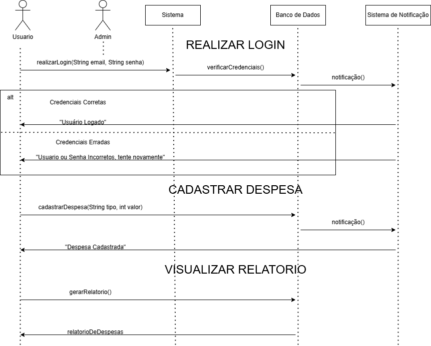
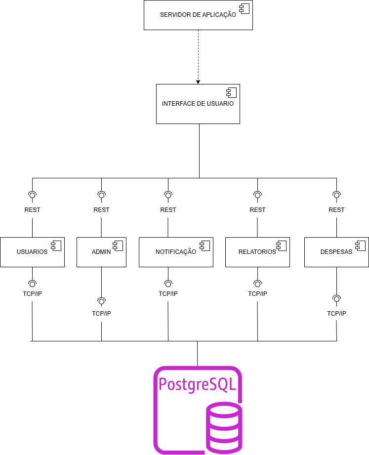
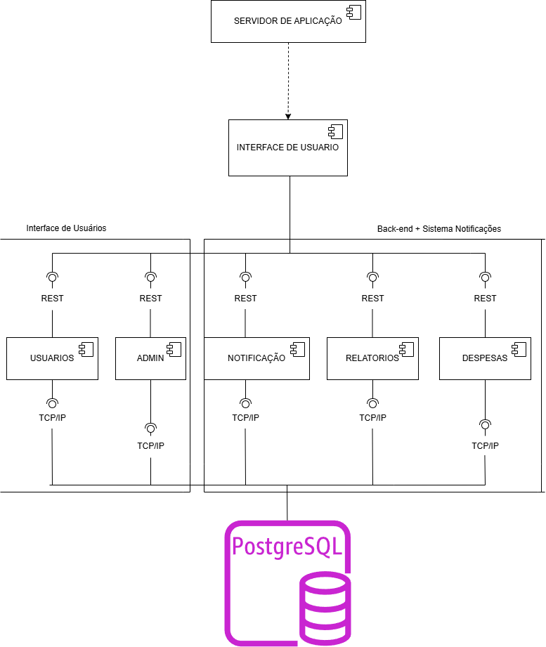

# 💰 Domus Finanças

Sistema de controle financeiro pessoal desenvolvido como parte do trabalho acadêmico da disciplina de Projeto de Software do curso de Engenharia de Software na **PUC Minas**.

## 📌 Objetivo

O **Domus Finanças** tem como propósito auxiliar usuários no gerenciamento de suas finanças pessoais, permitindo o registro de receitas e despesas, visualização de relatórios financeiros, definição de metas mensais e organização por categorias.

---

## ⚙️ Funcionalidades Principais

- ✅ Autenticação de usuários (login seguro)
- 💸 Cadastro de receitas e despesas
- 🏷️ Categorização de lançamentos
- 📊 Visualização de relatórios financeiros
- 🎯 Definição de metas mensais
- 👨‍💼 Administração de usuários (para administradores)

---

## 👥 Atores

- **Usuário**: realiza login, cadastra lançamentos, define metas e visualiza relatórios.
- **Administrador**: gerencia usuários cadastrados.

---

## 🗂️ Casos de Uso

| **ID**   | **Nome do Caso de Uso**                | **Atores Envolvidos**     | **Descrição**                                                                 |
|----------|----------------------------------------|----------------------------|-------------------------------------------------------------------------------|
| UC-01    | Realizar Login                         | Usuário, Administrador     | Permite que o usuário acesse o sistema utilizando e-mail e senha.            |
| UC-02    | Cadastrar Receita ou Despesa           | Usuário                    | Permite o registro de valores financeiros com categoria, data e valor.       |
| UC-03    | Visualizar Relatório Financeiro        | Usuário                    | Exibe um resumo gráfico e textual dos lançamentos por período.               |
| UC-04    | Definir Metas Financeiras              | Usuário                    | Permite configurar um valor de meta mensal e acompanhar o progresso.         |
| UC-05    | Gerenciar Usuários                     | Administrador              | Permite visualizar, bloquear ou excluir usuários do sistema.                 |

---

## 🧩 Modelagem UML

- ✅ Diagrama de Casos de Uso  
- ✅ Diagrama de Classes  
- ✅ Diagrama de Sequência  
- ✅ Diagrama de Comunicação  
- ✅ Diagrama de Estados  
- ✅ Modelo de Dados Relacional (DER)

---

## 📄 Documentação

A documentação desse projeto contém: 

- Introdução
- Modelagem de domínio e requisitos
- Diagramas estruturais e comportamentais
- Esquema de banco de dados
- Contratos de operação
- README técnico

---

## 📄 Visualizar Documento

  

----

## 📊 Diagramas
### Diagrama de Casos de Uso

### Diagrama de Classes

### Diagrama de Comunicação

### Diagramas de Sequencia

### Diagrama de Estados

### Diagrama de Componentes

### Diagrama de Implantação

## 👨‍🎓 Autores

Lucas Maia Rocha  
Davi Érico dos Santos

PUC Minas – Engenharia de Software – 4º período  
Trabalho acadêmico orientado por João Paulo Aramuni.

---

